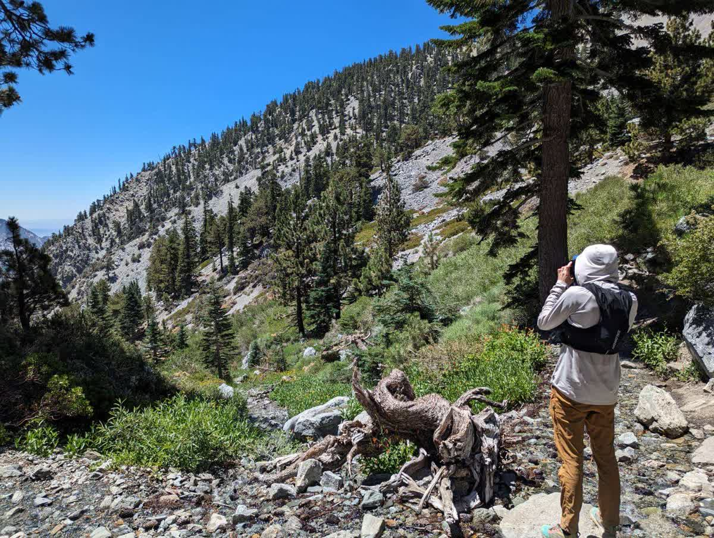

Welcome to Dan's corner. A part of my site dedicated to the stuff that I like. 

---

## Music Rec's
Some recent finds that I cannot get enough of...
* October 2023
    * [Masayoshi Takanaka](https://en.wikipedia.org/wiki/Masayoshi_Takanaka)
    * [Yabadum](https://yabadum.bandcamp.com/music)
* October 2022
    * [And the Kids](https://andthekidsmusic.bandcamp.com/)
    * [Remember Sports](https://www.remembersports.com/)
    * [Pinkshift](https://www.pinkshiftmd.com/)
* May 2022
    * [Peter Broderick](https://www.peterbroderick.net)
    * [The Royal They](https://theroyalthey.bandcamp.com)
    * [DAISY](http://www.daisytheband.com)
* March 2021
    * [Reliably Bad](https://www.reliablybad.com/)
    * [San Fermin](http://www.sanferminband.com)
    * [Miki Fiki](http://www.realmikifiki.com)
    * [Mother Falcon](http://www.motherfalcon.com)
    * [Forth Wanderers](http://www.forthwanderers.bandcamp.com)

---

## Recent Trips

### Colorado (September 2023)
Spent two weeks hiking! Bagged 14ers: Gray's, Torrey's, Elbert, Yale, and Blanca and explored the Maroon Bells Wilderness (pictured below). 

### Mt. San Antonio (August 2023)
Highest Peak in the San Gabriel Mountains!

### Sierra Nevadas (July 2023)
Skied Mammoth July 4th and toured July 5th (thank you 2022-23 snowpack!)

### Arches (May 2023)
Got to stop by Arches for a morning run!

### Cozumel (Jan 2023)
My first time diving in the tropics. Not sure if I can go back to the quarries of PA.

### The Enchantments (Sept 2022)
Mount Stewart was truly a test of resolve.

### Vail (March 2022)
Great skiing, great friends, and maybe a couple of cliffs.  

### Park City (January 2022)
I may have injured my ankle but the skiing was still great! 

### Dolly Sods (June 2021)
A really unique spot in WV. Beautiful place to hike in alpine meadows, jut be cautious given the complete lack of trail markers! 

### Tuckerman's Ravine (May 2021)
I never thought I would enjoy backcountry skiing, but I'm worried that doing Tucks has me hooked!

### Park City (January 2021)
Always practice with people who are better than you, its the best way to improve.

### Longs Peak (August 2019)
My first fourteener! Fantastic hike, but the altitude really took a toll.

### Unknown Icelandic Mountain (March 2017)
Beautiful hike in the Snæfellsjökull National Park.
unfortunately all the signs were buried in the snow, so I'm not actually sure which mountain it was.

### Mt. Marcy (August 2016)
A classic of the Adirondacks!
