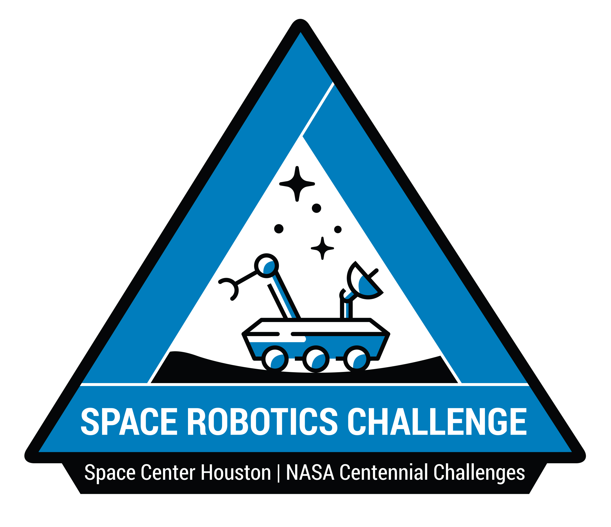
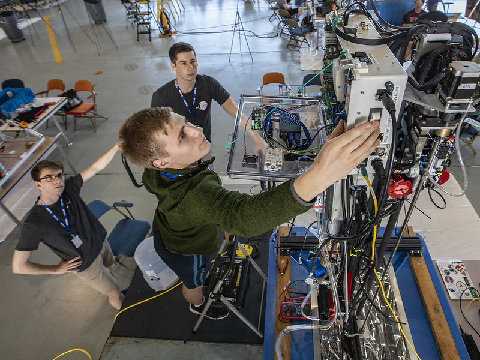

---
# NU Horizon

Research Goal: Develop novel techniques and algorithms for multi-agent robotic collection of resources in permanently shadowed regions of the Moon.

Program Website: [Space Robotics Challenge](https://ninesights.ninesigma.com/servlet/hype/IMT?userAction=Browse&documentId=d4414ecdb345e2190f661e20df641dee&templateName=)

---

# PUDLE: Prospecting Underground Liquid Extractor

Research Goal: Design a robotic system to collect water from subsurface ice deposits on Mars for the 2019 NASA Mars Ice Challenge.

Program Website: [Mars Ice Challenge](http://specialedition.rascal.nianet.org/)

Technical Report: [report](http://specialedition.rascal.nianet.org/wp-content/uploads/2019/06/2019-MMIP-Technical-Paper_Northeastern-University.pdf)

---

# PAWES: Planetary Articulating Water Extractor

Research Goal: Design a robotic system to collect water from subsurface ice deposits on Mars for the 2018 NASA Mars Ice Challenge.

Program Website: [Mars Ice Challenge](http://specialedition.rascal.nianet.org/)

Paper: [paper](https://ieeexplore.ieee.org/document/8741579)

---