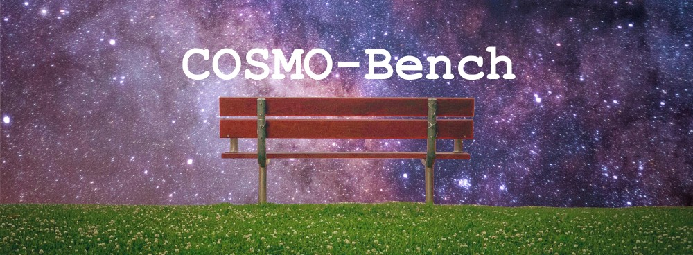
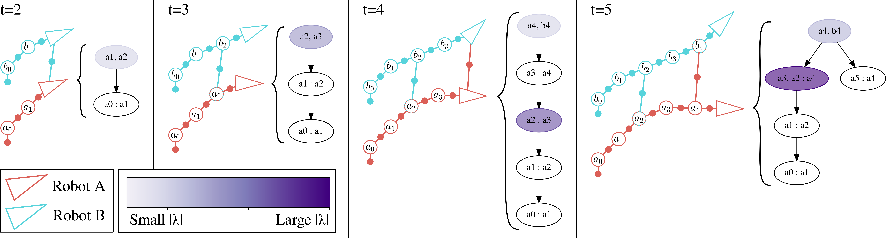
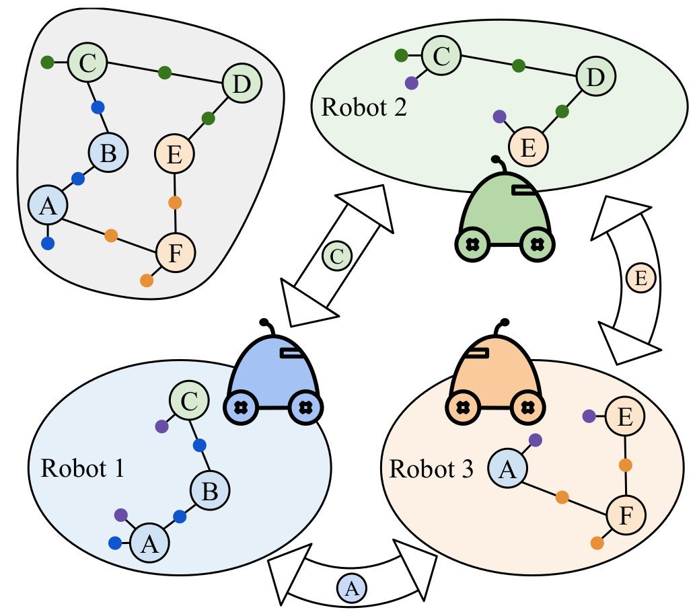
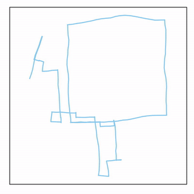
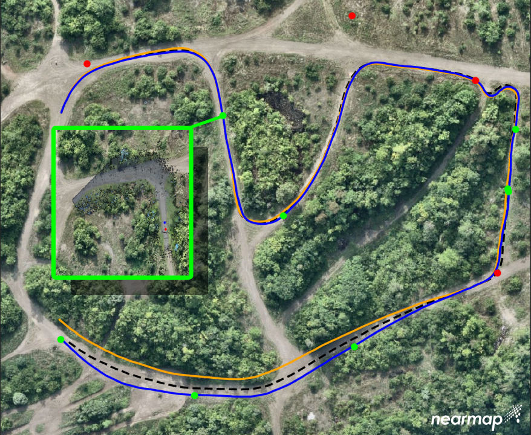

---

# Current Research - Robustness for Distributed Collaborative Simultaneous Localization and Mapping (C-SLAM)

Research Question: How can be enable robust distributed optimization for multi-robot teams?

Just like single robot scenarios, mutli-robot teams must content with outlier measurements that stem from perceptual aliasing. However, distributed optimization algorithms cannot necessarily be made robust by trivially integrating existing robust estimation techniques. This research looks to discover how to enable robustness in the context of distributed optimization for C-SLAM.

**Results Coming Soon!**

---

# COSMO-Bench: A Benchmark for Collaborative SLAM Optimization

<p align="center">

</p>

Recent years have seen a focus on research into distributed optimization algorithms for multi-robot Collaborative Simultaneous Localization and Mapping (C-SLAM). Research in this domain, however, is made difficult by a lack of standard benchmark datasets. Such datasets have been used to great effect in the field of single-robot SLAM, and researchers focused on multi-robot problems would benefit greatly from dedicated benchmark datasets. To address this gap, we design and release the Collaborative Open-Source Multi-robot Optimization Benchmark (COSMO-Bench) -- a suite of 24 datasets derived from a baseline C-SLAM front-end and real-world LiDAR data.

**Accepted to ICRA 2026**

|  Dataaset  | Paper  | Pre-Print | Official Publication |
| :----: | :----: | :----: | :----: |
| [cosmobench.com](https://cosmobench.com) | [PDF](./papers/ICRA_2026_COSMO-Bench.pdf) | [arXiv](https://arxiv.org/abs/2508.16731) | Coming Soon! |

Please cite as:
```
@inproceedings{mcgann_cosmobench_2026, 
    title = {{COSMO-Bench}: A Benchmark for Collaborative {SLAM} Optimization},
    author = {D. McGann and E.R. Potokar and M. Kaess},
    fullauthor = {Daniel McGann and Easton R. Potokar and Michael Kaess},
    year = 2026,
    booktitle = {Proc. IEEE Intl. Conf. on Robotics and Automation (ICRA)},
    address = {Vienna, {AT}},
    pages = {}, % Coming soon
}
```

---

# iMESA: Incremental Distributed Optimization for Collaborative Simultaneous Localization and Mapping

<p align="center">

</p>

Abstract: This paper introduces a novel incremental distributed back-end algorithm for Collaborative Simultaneous Localization and Mapping (C-SLAM). For real-world deploy- ments, robotic teams require algorithms to compute a consistent state estimate accurately, within online runtime constraints, and with potentially limited communication. Existing centralized, decentralized, and distributed approaches to solving C-SLAM problems struggle to achieve all of these goals. To address this capability gap, we present Incremental Manifold Edge-based Separable ADMM (iMESA) a fully distributed C-SLAM back-end algorithm that can provide a multi-robot team with accurate state estimates in real-time with only sparse pair-wise communication between robots. Extensive evaluation on real and synthetic data demonstrates that iMESA is able to outperform comparable state-of-the-art C-SLAM back-ends.

**Accepted to RSS 2024**

|  Code  | Paper  | Pre-Print | Official Publication |
| :----: | :----: | :----: | :----: |
| [github](https://github.com/rpl-cmu/imesa) | [PDF](./papers/RSS_2024_iMESA.pdf) | [arXiv](https://arxiv.org/abs/2406.07371) | [RSS](https://www.roboticsproceedings.org/rss20/p085.html) |

Please cite as:
```
@inproceedings{mcgann_imesa_2024, 
    title = { {iMESA}: Incremental Distributed Optimization for Collaborative Simultaneous Localization and Mapping},
    author = {D. McGann and M. Kaess},
    fullauthor = {Daniel McGann and Michael Kaess},
    year = 2024,
    booktitle = {Proc. Robotics: Science and Systems (RSS)},
    address = {Delft, {NL}}
}
```

---

# Asynchronous Distributed Smoothing and Mapping via On-Manifold Consensus ADMM

<p align="center">

</p>

Abstract: In this paper we present a fully distributed, asynchronous, and general purpose optimization algorithm for Consensus Simultaneous Localization and Mapping (CSLAM). Multi-robot teams require that agents have timely and accurate solutions to their state as well as the states of the other robots in the team. To optimize this solution we develop a CSLAM back-end based on Consensus ADMM called MESA (Manifold, Edge-based, Separable ADMM). MESA is fully distributed to tolerate failures of individual robots, asynchronous to tolerate practical network conditions, and general purpose to handle any CSLAM problem formulation. We demonstrate that MESA exhibits superior convergence rates and accuracy compare to existing state-of-the art CSLAM back-end optimizers.

**Accepted to ICRA 2024!** 

**Finalist for Best Paper Award on Multi-Robot Systems**

|  Code  | Paper | Pre-Print | Official Publication |
| :----: | :----: | :----: | :----: |
| [github](https://github.com/rpl-cmu/mesa) | [PDF](./papers/ICRA_2024_MESA.pdf) | [arXiv](https://arxiv.org/abs/2310.12320) | [IEEE Xplore](https://ieeexplore.ieee.org/abstract/document/10611193) |


Please cite as:
```
@inproceedings{mcgann_mesa_2024, 
    title = {Asynchronous Distributed Smoothing and Mapping via On-Manifold Consensus {ADMM}},
    author = {D. McGann and K. Lassak and M. Kaess},
    fullauthor = {Daniel McGann and Kyle Lassak and Michael Kaess},
    year = 2024,
    booktitle = {Proc. IEEE Intl. Conf. on Robotics and Automation (ICRA)},
    address = {Yokohama, {JP}},
    pages = {4577-4583},
}
```

---

# Robust Incremental Smoothing and Mapping (riSAM)

<p align="center">

</p>

Abstract: This paper presents a method for robust optimization for online incremental Simultaneous Localization and Mapping (SLAM). Due to the NP-Hardness of data association in the presence of perceptual aliasing, tractable (approximate) approaches to data association will produce erroneous measurements. We require SLAM back-ends that can converge to accurate solutions in the presence of outlier measurements while meeting online efficiency constraints. Existing robust SLAM methods either remain sensitive to outliers, become increasingly sensitive to initialization, or fail to provide online efficiency. We present the robust incremental Smoothing and Mapping (riSAM) algorithm, a robust back-end optimizer for incremental SLAM based on Graduated Non-Convexity. We demonstrate on benchmarking datasets that our algorithm achieves online efficiency, outperforms existing online approaches, and matches or improves the performance of existing offline methods. 

**Accepted to ICRA 2023!**


|  Code  | Paper | Pre-Print | Official Publication |
| :----: | :----: | :----: | :----: |
| [github](https://github.com/rpl-cmu/risam) | [PDF](./papers/ICRA_2023_riSAM.pdf) | [arXiv](https://arxiv.org/abs/2209.14359) | [IEEE Xplore](https://ieeexplore.ieee.org/document/10161438) |

Please cite as:
```
@inproceedings{mcgann_risam_2023, 
    title = {Robust Incremental Smoothing and Mapping ({riSAM})},
    author = {D. McGann and J. G. {Rogers III} and M. Kaess},
    fullauthor = {Daniel McGann and John G. Rogers III and Michael Kaess},
    year = 2023,
    booktitle = {Proc. IEEE Intl. Conf. on Robotics and Automation (ICRA)},
    address = {London, {GB}},
    pages = {4157-4163},
}
```

---

# GPS-Denied Global Visual-Inertial Ground Vehicle State Estimation via Image Registration
<p align="center">

</p>

Abstract: Robotic systems such as unmanned ground vehicles (UGVs) often depend on GPS for navigation in outdoor environments. In GPS-denied environments, one approach to maintain a global state estimate is localizing based on preexisting georeferenced aerial or satellite imagery. However, this is inherently challenged by the significantly differing perspectives between the UGV and reference images. In this paper, we introduce a system for global localization of UGVs in remote, natural environments. We use multi-stereo visual inertial odometry (MSVIO) to provide local tracking. To overcome the challenge of differing viewpoints we use a probabilistic occupancy model to generate synthetic orthographic images from color images taken by the UGV. We then derive global information by scan matching local images to existing reference imagery and then use a pose graph to fuse the measurements to provide uninterrupted global positioning after loss of GPS signal. We show that our system generates visually accurate orthographic images of the environment, provides reliable global measurements, and maintains an accurate global state estimate in GPS-denied conditions.

**Accepted to ICRA 2022**

| Paper | Official Publication |
| :----: | :----: |
| [PDF](./papers/ICRA_2022_Globally_Consistent_UGV_VIO.pdf) | [IEEE Xplore](https://ieeexplore.ieee.org/document/9812364) |


---

# PUDLE: Prospecting Underground Liquid Extractor


Research Goal: Design a robotic system to collect water from subsurface ice deposits on Mars for the 2019 NASA Mars Ice Challenge.

Technical Report: [Link](http://specialedition.rascal.nianet.org/wp-content/uploads/2019/06/2019-MMIP-Technical-Paper_Northeastern-University.pdf)

Program Website: [Mars Ice Challenge](http://specialedition.rascal.nianet.org/)


---

# PAWES: Planetary Articulating Water Extractor


Research Goal: Design a robotic system to collect water from subsurface ice deposits on Mars for the 2018 NASA Mars Ice Challenge.

**Accepted to 2019 IEEE Aerospace Conference**

Conference Paper: [Link](https://ieeexplore.ieee.org/document/8741579)

Program Website: [Mars Ice Challenge](http://specialedition.rascal.nianet.org/)

---